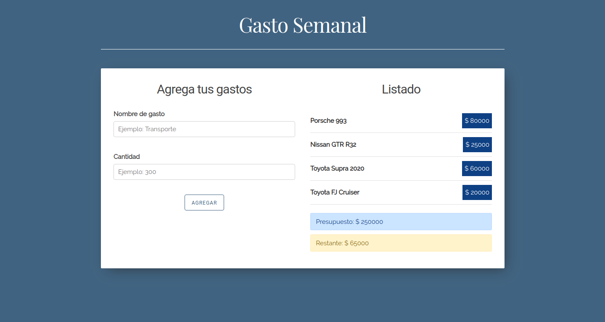

# Gasto Semanal

Aplicación ReactJS que almacena gastos, y hace cálculos en base a un presupuesto determinado ingresado por el usuario

## Scripts

* `npm install` para instalar las dependencias
* `npm run dev` para entorno de desarrollo
* `npm run build && npm start` para producción

**Nota**: en caso de no tener instalado el paquete **serve** para correr el entorno de desarrollo, se puede descargar desde el siguiente enlace: `npm i -g serve`

## Licencia

MIT

This project was bootstrapped with [Create React App]
(https://github.com/facebookincubator/create-react-app).
